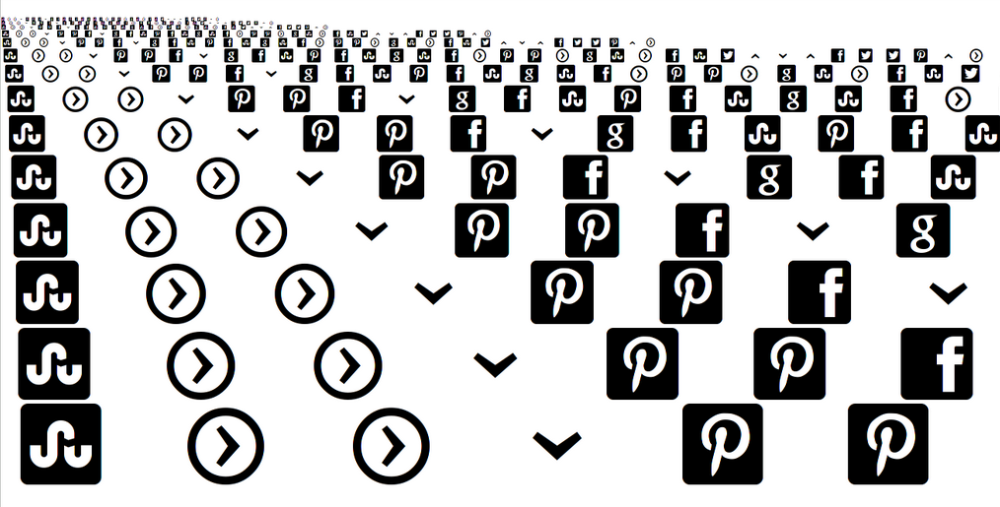
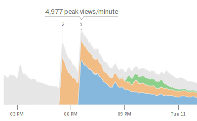
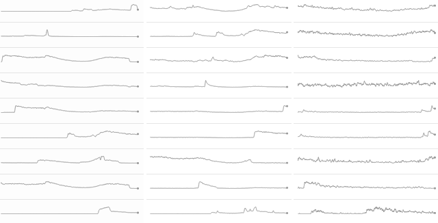
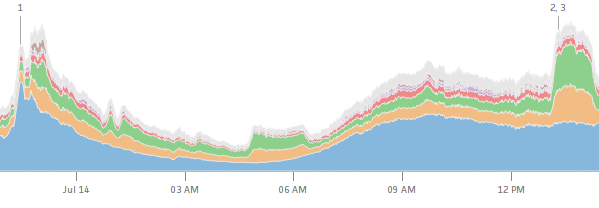
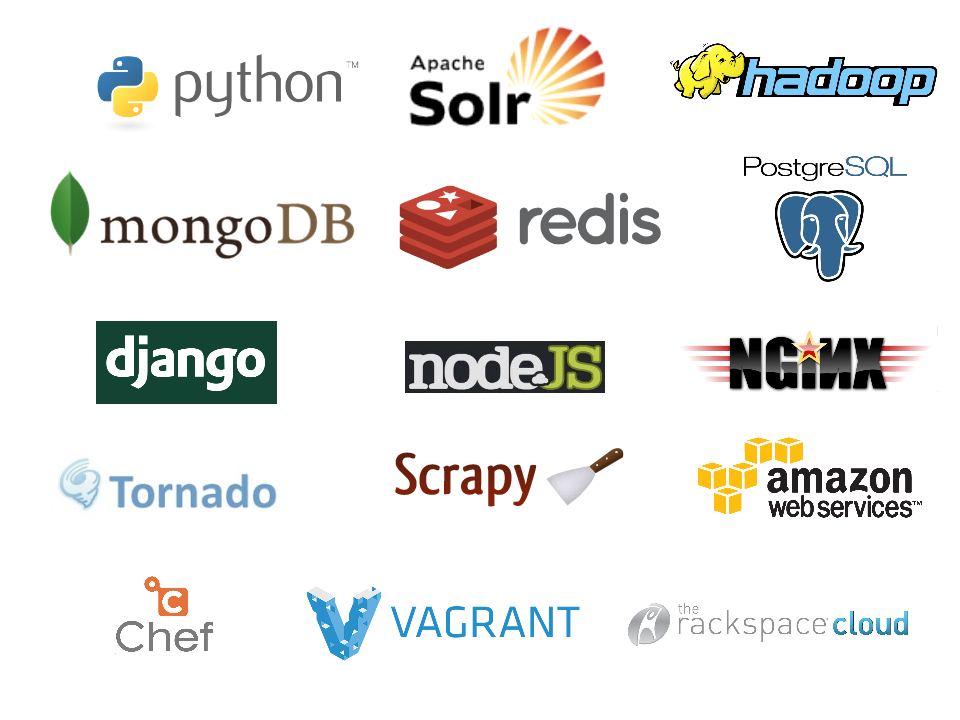

==============
Rapid Data Viz
==============

Andrew Montalenti, CTO

.. rst-class:: logo

    .. image:: ./_static/parsely.png
        :width: 40%
        :align: right

What do we do?
==============

Parse.ly customers
==================

.. figure:: /_static/logos.png
    :width: 90%
    :align: center

Is online media special?
========================

Websites have a variety of interesting "first-party" metrics:

* pageviews
* unique visitors
* sessions and paths
* time spent
* page engagement (scroll, copy/paste)
* referrers
* search keywords

Third-party metrics emerging
============================

* **Comments**: Disqus, LiveFyre, Wordpress
* **Shares**: Twitter, Google+, LinkedIn, Facebook
* **Pins and Saves**: Pinterest, Delicious
* **Upvotes and Likes**: Reddit, Digg
* **Queues**: Instapaper, Readability

What about online journalism?
=============================

* **Short Shelf Life**: average content shelf-life <48 hours
* **High Frequency Publishing**: 1000's posts per day
* **Unclear Conversion Goals**: nothing to buy
 

Time series data
================

Summary breakdowns
==================

.. rst-class:: spaced

    .. image:: ./_static/summary_viz.png
        :align: center

Benchmark statistics
====================

.. rst-class:: spaced

    .. image:: ./_static/benchmarked_viz.png
        :align: center

Information radiators
=====================

.. rst-class:: spaced

    .. image:: ./_static/glimpse.png
        :width: 100%
        :align: center

Contextual overlays
===================

.. rst-class:: spaced

    .. image:: ./_static/extension.png
        :width: 100%
        :align: center

How do we do it?
================

Parse.ly careers
================

.. figure:: /_static/team_jobs.png
    :width: 70%
    :align: center

Data Visualization Theory
=========================

Three people:

* Edward Tufte
* Mike Bostock
* Benjamin Fry

Edward Tufte
============

.. rst-class:: spaced

    .. image:: ./_static/et_dash.jpg
        :width: 80%
        :align: center

Tufte: Do Whatever It Takes
===========================

.. rst-class:: spaced

    .. image:: ./_static/minard.png
        :width: 100%
        :align: center

data-ink ratio, cognitive style, chartjunk 

Bostock: Embrace Standards
==========================

.. rst-class:: spaced

    .. image:: ./_static/data_join.png
        :width: 70%
        :align: center

not just charts, data-document joins

Fry: It's a Process
===================

.. rst-class:: spaced

    .. image:: ./_static/process_01.png
        :width: 100%
        :align: center

    .. image:: ./_static/process_02.png
        :width: 100%
        :align: center

multi-disciplanary process, feedback loops, iteration

Chart Types (1)
===============

.. rst-class:: spaced

    .. image:: ./_static/elements_01.png
    .. image:: ./_static/elements_05.png
    .. image:: ./_static/elements_06.png

Chart Types (2)
===============

Paradox of choice?

.. rst-class:: spaced

    .. image:: ./_static/elements_02.png
    .. image:: ./_static/elements_03.png
    .. image:: ./_static/elements_04.png

Encoding Guide (1)
==================

.. rst-class:: spaced

    .. image:: ./_static/viz_elements.png
        :width: 80%
        :align: center

Encoding Guide (2)
==================

.. rst-class:: spaced

    .. image:: ./_static/elements_table.png
        :width: 80%
        :align: center

Data
====

.. rst-class:: spaced

    .. image:: ./_static/data_set.png
        :width: 80%
        :align: center

Documents
=========

.. rst-class:: spaced

    .. image:: ./_static/data_values.png
        :width: 80%
        :align: center

Data-Driven Documents
=====================

.. rst-class:: spaced

    .. image:: ./_static/data_highlights.png
        :width: 80%
        :align: center

Dense Displays
==============

.. rst-class:: spaced

    .. image:: ./_static/more_data.png
        :width: 80%
        :align: center

How to iterate?
===============

    .. image:: ./_static/process_03.png
        :width: 100%
        :align: center

Tools for everything, but no **dataviz REPL**.

Or is there? Enter IPython Notebook, Pandas, the web.

Demo Time!
=========

.. rst-class:: spaced

    .. image:: ./_static/authority_report.png
        :width: 80%
        :align: center

Interesting IPyNB Things
========================

* IPython cell magics (``%%html``, ``%%javascript``)
* cdnjs
* display framework
* new widget / channel communication framework
* ipython locate profile

My Tools
========

    =========== ===================================
    Step        Tools
    =========== ===================================
    acquire     pymongo, solr, apache pig
    parse       python stdlib, custom tools
    filter      ipython notebook, listcomps
    mine        pandas
    represent   matplotlib, vincent, nvd3
    refine      d3, chrome inspector
    interact    d3
    =========== ===================================

d3
==

* selections
* svg
* scales
* axes
* data
* joins

d3 scales
=========

.. sourcecode:: javascript

    var data = [1, 2, 3, 4, 5];

    var width = 500;
    var height = 200;

    var x = d3.scale
                .linear()
                .domain([0, d3.max(data)])
                .range([0, width]);
    var y = d3.scale
                .ordinal()
                .domain(data)
                .rangeBands([0, height]);

d3 scaling
==========

.. sourcecode:: javascript

    x(4.5) // -> 
    y.rangeBand() // ->

d3 drawing
==========

.. sourcecode:: javascript

    var chart = d3.select("#container")
      .append("svg")
        .attr("class", "chart")
        .attr("width", width)
        .attr("height", height)
      .append("svg:g");
    
    chart.selectAll("rect")
        .data(data)
        .enter()
            .append("svg:rect")
                .attr("height", x)
                .attr("x", y)
                .attr("y", function(d) { return height - x(d); })
                .attr("width", y.rangeBand());

nvd3
====

* models
* charts
* tooltips
* utilities

vincent
=======

* vega (JSON)
* declarative visualizations
* HTML canvas

pandas
======

* dataframes
* loading
* aggregates
* grouping
* sorting
* serializing
* matplotlib

IPyNB
=====

* execution
* display
* saving / sharing
* platform unification

Three Use Cases
===============

* mine network referrers for trends (pixel data)
* find outlier response times (API nginx logs)
* compare real-time traffic (JSON query response)

d3-oriented Approach
====================

* iterate with Pandas and matplotlib
* convert dataframe to JSON
* load JSON with d3
* use d3 for final cleaning
* build scales / axes / labels from scratch
* build interaction layer from scratch
* for offline, use PhantomJS render

nvd3 add-on
===========

* use canned nvd3 chart type
* customize interaction layer atop

Vega-oriented Approach
======================

* use vincent inside IPyNB
* get vega JSON into browser
* use vega JS library to parse JSON
* vega runtime generates d3 instructions
* for offline mode, use vg2png/vg2svg

Future Nirvana
==============

* edit data with Pandas in IPyNB
* snapshot data as JSON cell
* edit d3 / nvd3 code in ``%%javascript`` cell
* use ``IPython.display`` to show d3 rendering result 
* interactive rendering via ``IPython.kernel.comm``

Type Into Browser
=================

.. rst-class:: bigger

    **Links:**

    - parse.ly/jobs
    - parse.ly/authority

    **Contacts:**

    - @amontalenti
    - @parsely

    **Questions?**

.. ifnotslides::

    .. raw:: html

        

.. ifslides::

    .. raw:: html

        
